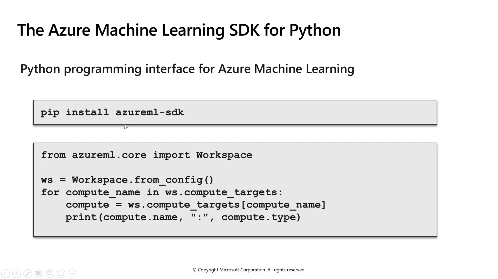
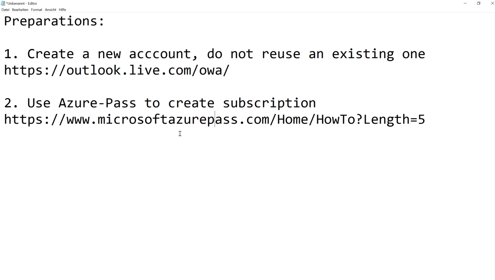
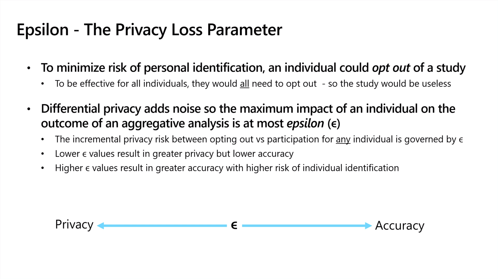

# Training Notes: Azure Assiciate Data Scientist (DP-100)

## General

* [AzureML Feature Requests](https://feedback.azure.com/forums/34192--general-feedback)

## Day 1 - 01.02.2021

### Module 1:

### Lab 1:

* [link to MSLEARN-DP100](https://microsoftlearning.github.io/mslearn-dp100/instructions/01-create-a-workspace.html)

Basics
* Subscription: Azure Pass - Sponsorship
* Resource group: (New) rg-ml-001
* Region: West Europe
* Workspace name: ml-001
* Storage account: (new) ml0019425880163
* Key vault: (new) ml0015577166267
* Application insights: (new) ml0016839476282
* Container registry: None
* Networking: Connectivity method
* Public endpoint (all networks): Advanced
* Encryption type: Microsoft-managed keys
* Enable HBI Flag: Disabled

ssh-key:
az_training_dp_100(.pub)
passphrase: MicroBicro0148

## Module 2:

### Azure Automated Machine Learning

### Lab 2:

* [link to MSLEARN-DP100](https://microsoftlearning.github.io/mslearn-dp100/instructions/02-automated-ml.html)

### Azure Machine Learning Designer

### Lab 3:

* [link to MSLEARN-DP100](https://microsoftlearning.github.io/mslearn-dp100/instructions/02-automated-ml.html)

* Model Results:
    
        ./mslearn-dp100/labs/Lab3/DiabetesLogisticRegression_model_outputs

## Day 2 - 02.02.2021

### Introduction to Experiments

### Training an Resitering Models

## Datastores & Datasets

## Environments

[Curated environments - Azure Machine Learning | Microsoft Docs](https://docs.microsoft.com/en-us/azure/machine-learning/resource-curated-environments)

[Set up local compute targets](https://docs.microsoft.com/en-us/azure/machine-learning/how-to-attach-compute-targets#local)
[Configure and submit training runs](https://docs.microsoft.com/de-de/azure/machine-learning/how-to-set-up-training-targets)

## Pipelines

## Inferencing

## Model Tuning

### Hyperparameter Tuning

### Automated Machine Learning

## Responsible Machine Learning

* [Co-Designing Checklists to Understand Organizational
Challenges and Opportunities around Fairness in AI](http://www.jennwv.com/papers/checklists.pdf)

## Monitoring Models

### Application Insights

### Data Drift

